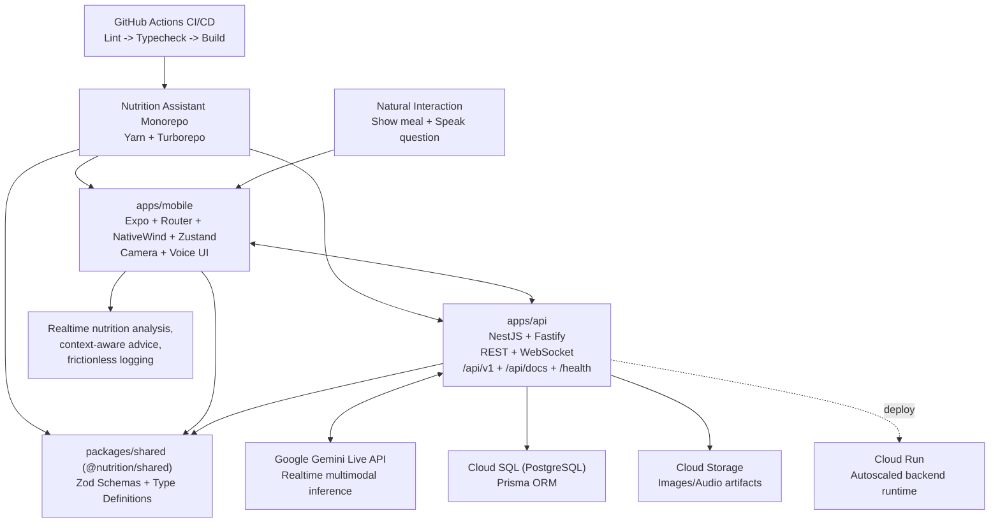

```mermaid
flowchart TD
  CI["GitHub Actions CI/CD\nLint -> Typecheck -> Build"] --> MONO["Nutrition Assistant Monorepo\nYarn + Turborepo"]

  MONO --> MOBILE["apps/mobile\nExpo + Router + NativeWind + Zustand\nCamera + Voice UI"]
  MONO --> API["apps/api\nNestJS + Fastify\nREST + WebSocket\n/api/v1 + /api/docs + /health"]
  MONO --> SHARED["packages/shared (@nutrition/shared)\nZod Schemas + Type Definitions"]

  MOBILE <--> API
  MOBILE --> SHARED
  API --> SHARED

  API <--> GEMINI["Google Gemini Live API\nRealtime multimodal inference"]
  API --> SQL["Cloud SQL (PostgreSQL)\nPrisma ORM"]
  API --> STORAGE["Cloud Storage\nImages/Audio artifacts"]

  API -. deploy .-> RUN["Cloud Run\nAutoscaled backend runtime"]

  USER["Natural Interaction\nShow meal + Speak question"] --> MOBILE
  MOBILE --> RESULT["Realtime nutrition analysis,\ncontext-aware advice,\nfrictionless logging"]

```